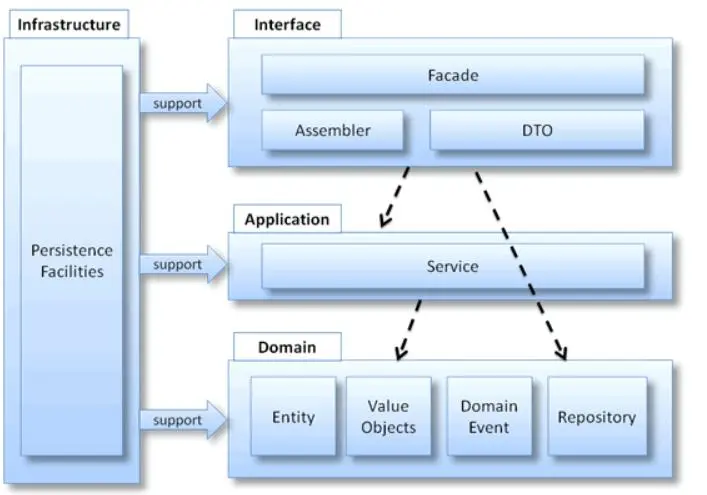

# php-ddd

## 四层架构


## 理解层的作用
````
// 服务 A（订单服务）
order-service/
├── domain/        # 领域层（定义接口）
├── application/   # 应用层
└── infrastructure/
├── jpa/      # 实现领域层的持久化接口
└── kafka/    # 消息生产实现

// 服务 B（用户服务）
user-service/
├── domain/        # 领域层（定义接口）
├── application/
└── infrastructure/
├── mongodb/  # 实现领域层的持久化接口
└── redis/     # 缓存实现
````

## 微服务架构中的常见实践
- 独立基础设施层：在微服务架构中，每个服务通常拥有独立的基础设施层，以实现技术栈的灵活性和服务自治。
- 例外：跨服务的横切关注点（如监控、认证）可通过统一中间件（如 API Gateway、集中式日志系统）解决，而非代码复用。